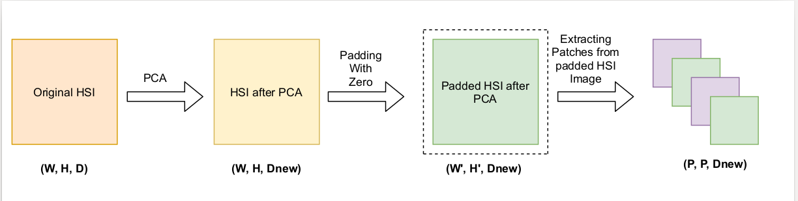
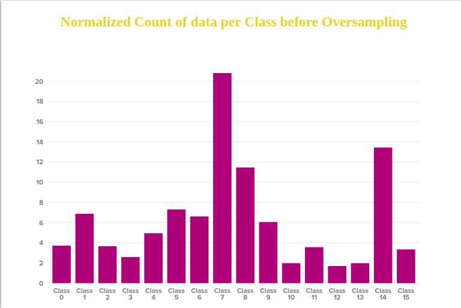
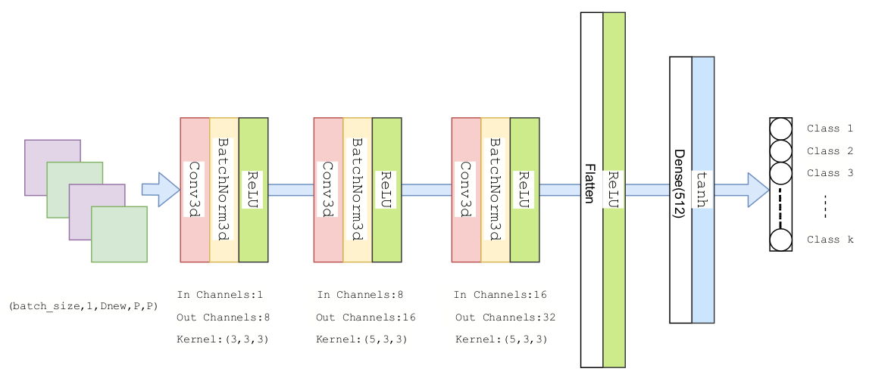
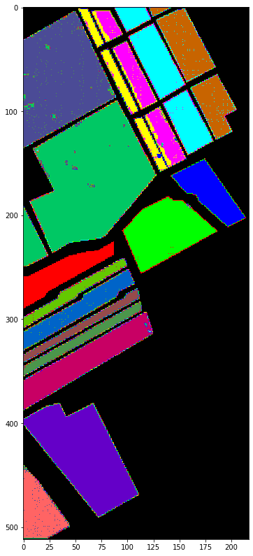
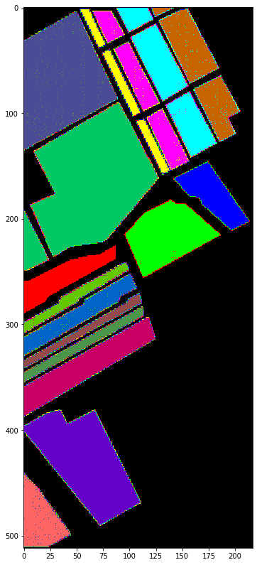
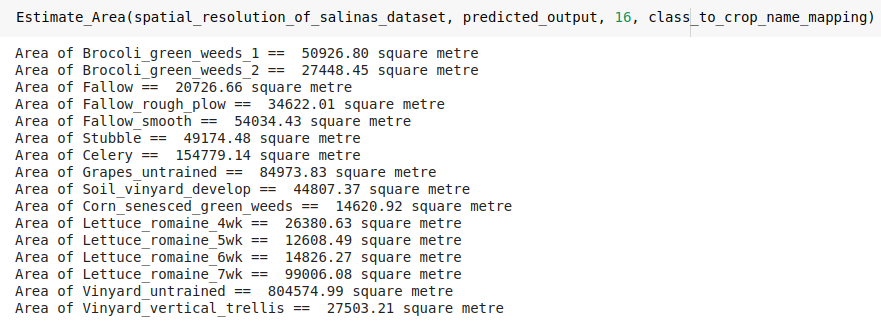

# Classification-of-Horticulture-plantations-using-hyperspectral-Images-and-Area-Estimation.

<h1>Content:</h1>
<a href="#obj" >1. Objective</a> 
<a href="#pre" >2. Preprocessing </a> 
<a href="#model" >3. Model Architecture</a> 
<a href="#res" >4. Result</a> 
<a href="#app" >5. Appendix</a> 

<h1 id="obj">1. Objective:</h1>

<strong>The main objective of this project is to 
  <ul>
    <li>Classify Horticulture plantations using Hyperspectral Images.</li>
    <li>Generation of crop map for the selected horticulture crops in the study areas and area estimation.</li>
  </ul>
</strong>
 

<h1 id="pre">2. Preprocessing:</h1>

Let’s denote HSI by D which has dimension (w, h, d), where ‘w’ is the width, ‘h’ is the
height and ‘d’ is the number of spectral bands in HSI. In order to remove the spectral
redundancy in HSI data we apply PCA on its spectral bands. After application of PCA new
dimension that we obtained is given by (w, h, dnew). Then we pad the boundary of HSI with
zero with margin = (patch_size-1)/2. Padded image is then divided into small overlapping
patches of dimension (patch size, patch size, dnew). The label of the patched image is governed
by label of the cantered pixel

After pre-processing we split the data into train and validation set in the ratio 7:3. The number
of observation per class in our dataset is not equally distributed, it varies between 20.82% for
majority class to 1.69% for minority class. To tackle this issue we apply smote oversampling
technique on training dataset only and leave validation dataset as it is. After getting balanced
training data we grouped training data in the batch size of 16, and feed it into our proposed
model.

<h1 id="model">3. Model Architecture:</h1>

During training, the input to our model is a 3D-data of size (patch size, patch size, dnew). The
data is passed through a stack of 3D-Convolution layers, where we use 3D kernel of size
(3,3,3) in first convolution block and (5,3,3) in rest two convolution block. Each 3D-
Convolution layer is followed by BatchNorm3D layer. We used relu activation unit for every
layer except the last layer where we used tanh activation unit.

<h1 id="res">2. Result:</h1>

Below is the classification report obtained on the validation dataset for patch size = 9 and
dnew = 20 on salinas dataset.

<h3>Predicted Crop map</h3>

<h3>Ground Truth Crop map</h3>

<h3>Estimated Area on salinas dataset</h3>

<h1 id="app">5. Appendix:</h1>

<h4>Abbreviation:</h4>
W: Width of HSI 
H: Height of HSI 
D: Number of Spectral band  in HSI 
Dnew: Number of Spectral band in HSI after PCA 
W': Width of HSI after padding with zero. 
H' : Height of HSI after padding with zero. 
P: Patch size 
HSI: Hyperspectral Image 

<h4>Reference:</h4>

[1]<a href="http://www.ehu.eus/ccwintco/index.php/Hyperspectral_Remote_Sensing_Scenes">Salinas dataset</a>

[2]<a href="https://arxiv.org/abs/1902.06701">HybridSN: Exploring 3-D–2-D CNN Feature
Hierarchy for Hyperspectral Image Classification</a>

